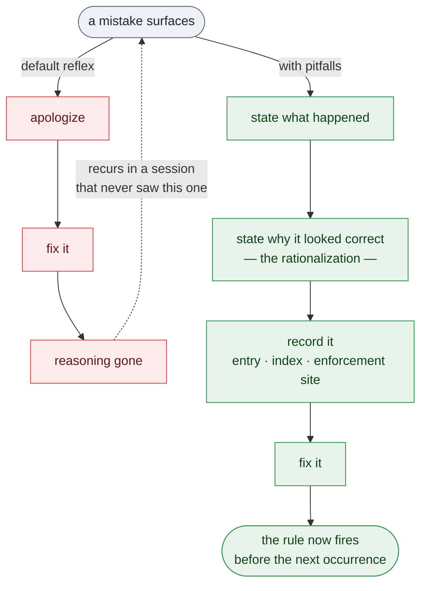

# pitfalls

**A Claude Code skill that makes an agent record why it made a mistake — before it fixes it.**

The most common complaint about coding agents is that they repeat the same mistakes. The reason is
not that they are careless. It is that the moment a mistake is discovered, this happens:

> "You're right, sorry — I misread that. Let me fix it."

...followed instantly by the fix. It reads as accountability. It is the fastest possible way to
destroy the only part of the incident worth keeping.

**The fix is the cheap half.** Anyone can fix a mistake once it has been pointed out. The reasoning
that produced it is the expensive half — and it is the half that produces the next one. That
reasoning is recoverable for about one moment: right after discovery, before the correction exists.
Afterwards the wrong path stops looking plausible, becomes obvious in hindsight, and cannot be
reconstructed. It is gone, along with any chance of recognizing it the next time it shows up wearing
a different disguise.

This skill inverts the order.

---

## What it changes



The left branch is a loop — the same class of mistake returns, because nothing about the system
changed. The right branch terminates: two extra steps, about two minutes, and the incident becomes
an asset instead of an interruption.

## It fires on its own

This is the part that matters. The skill is not something you invoke after noticing the agent
messed up — that model still requires a human to catch every miss personally.

It triggers on **self-detection**: the agent finds a defect in code it wrote, a test fails on
something it asserted was correct, a review turns up its own flawed work, new evidence contradicts a
verdict it gave, it catches itself about to repeat a rule already in the file. The internal moment of
*"actually, that's wrong"* is the trigger, and the rule is that the next sentence cannot be the fix.

Being corrected by a human is handled too — but as the secondary path. An agent that only learns
when told is not learning; it is being taught, one correction at a time, by someone who has to
notice everything.

## The three artifacts

An incident is captured only when all three exist:

| | |
|---|---|
| **The record** | A seven-field entry whose critical field is **the rationalization** — the reasoning as it actually ran, first person, in the tense of someone who still believes it. Usually a sound-looking argument where every clause is true and the conclusion is wrong. That is what makes it dangerous, and it is what a bare rule cannot defeat: the next occurrence will not feel like a mistake either, it will feel like that same reasonable argument. |
| **The index** | One imperative line, loaded at the start of every session. A rule that is not in the index does not fire. |
| **The enforcement site** | The specific step in the specific workflow where the rule now lives, so it fires whether or not anyone remembers it. A rule in a list is consulted when someone thinks to consult it. That is not enforcement. |

Plus one rule that makes the whole thing auditable:

> **The closing line of any answer about a mistake must contain a real file path — or the words
> "not written down yet."**

No path and no disclaimer means the lesson was narrated rather than recorded. It is deliberately
mechanical — checkable by looking at the output rather than by trusting the intent behind it. That
is the only kind of rule that survives being inconvenient, and the moment after a mistake is always
inconvenient.

---

## Install

```bash
git clone https://github.com/MMichael20/pitfalls.git ~/.claude/skills/pitfalls
```

Windows:

```powershell
git clone https://github.com/MMichael20/pitfalls.git "$env:USERPROFILE\.claude\skills\pitfalls"
```

Then run `/pitfalls` once in any project you want covered. It creates `.claude/pitfalls.md`, adds the
enforcement block to that project's `CLAUDE.md`, and is live from the next message.

That is the whole setup. No hooks, no configuration, no daemon — the behaviour comes from the skill
description and a block of text the project already loads on every session. Once the block is in the
repo, everyone who works in that repo gets it, including agents that have never seen this README.

The pitfalls file starts empty. Entries are earned, never invented.

---

## What does not belong in a pitfalls file

- **Facts** about how a system behaves — that is knowledge, different file.
- **Preferences** about how to work — that is configuration.
- **Errors with no reasoning behind them** — typos, transient failures. Nothing to learn.
- **Anything a test, type, or lint rule can catch.** Add the check; it is a strictly better
  enforcement site than a paragraph asking politely.

The bar: *would a competent agent, acting in good faith, make this mistake again next month?*

---

## Design notes

**No apologies.** Not because apologizing is wrong, but because it occupies the exact slot where the
reasoning belongs, and it feels like it discharges the obligation. "Sorry, my mistake" closes an
incident emotionally while leaving it open operationally.

**Append only, never renumber.** Entries are cited by number from other files. A tidy-up that
renumbers them silently breaks every cross-reference in the project.

**Fix enforcement, don't add siblings.** If an existing rule should have caught the mistake and did
not, *that is the finding.* Ask why it did not fire — unfindable, unclear, wrong place, too easy to
argue around — and fix that. A second rule saying the same thing louder is how a rule list turns into
noise that gets skimmed.

**A missing workflow is the real finding.** If the mistake happened inside a multi-step process that
exists only in someone's head, write the process down. A procedure carried out by hand twice should
have been documented after the first time.

**Ships empty on purpose.** No example entries. A pitfalls file full of someone else's incidents
trains the wrong instinct — that entries are written to illustrate a format rather than because
something actually went wrong.

---

MIT. Issues and pull requests welcome.
